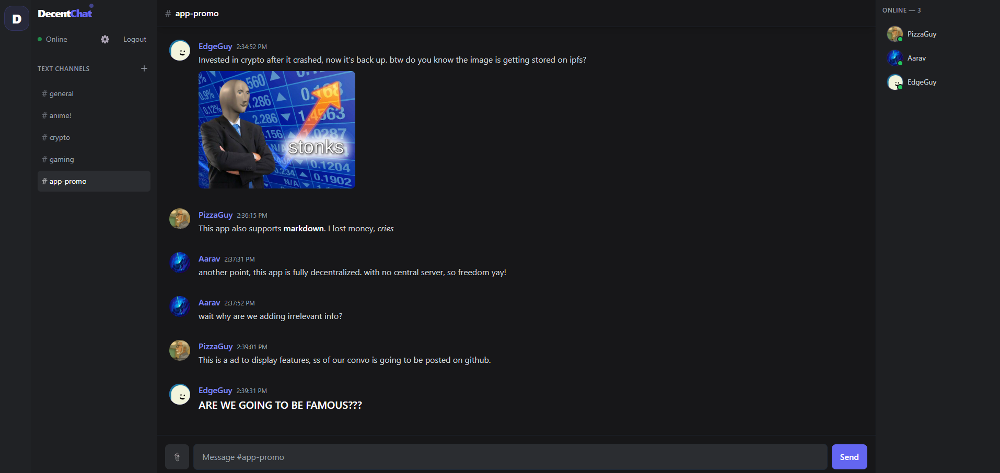

# DecentChat

A modern decentralized chat application with real-time messaging, user presence, and media sharing capabilities.



## Features

### Real-time Communication
- Instant messaging with real-time updates
- Channel-based communication
- User presence indicators
- Multiple channels support with dynamic channel creation

### Media Sharing
- Image sharing with IPFS integration
- Automatic image compression and optimization
- Support for viewing images in full-screen mode
- Persistent storage using IPFS for reliable media access

### User Management
- Secure user authentication
- Customizable user profiles
- Persistent user sessions
- Avatars stored on IPFS for decentralized storage

### Modern UI/UX
- Discord-inspired interface
- Mobile-responsive design
- Dark mode by default
- Smooth animations and transitions
- Markdown support in messages
- Image previews and galleries

### Technical Features
- Built with React + TypeScript
- Decentralized architecture
- End-to-end encryption
- IPFS integration for media storage
- Persistent data storage
- Efficient real-time updates

## Getting Started

1. Clone the repository:
```bash
git clone https://github.com/yourusername/DecentChat.git
cd DecentChat
```

2. Install dependencies:
```bash
npm install
```

3. Configure environment variables:
   - Copy `src/config-example.ts` to `src/config.ts`
   - Add your Pinata API keys

4. Start the development server:
```bash
npm start
```

## Architecture

### Media Storage
The application uses IPFS (InterPlanetary File System) for storing media files:
- Images are automatically compressed and optimized before upload
- Content is stored permanently on IPFS
- Content addressing ensures data integrity
- Distributed storage provides reliable access

### Security
- End-to-end encryption for messages
- Secure user authentication
- Session persistence
- No central server required

### Performance
- Automatic image optimization
- Lazy loading of media content
- Efficient real-time updates
- Responsive design for all devices

## Contributing

1. Fork the repository
2. Create your feature branch (`git checkout -b feature/AmazingFeature`)
3. Commit your changes (`git commit -m 'Add some AmazingFeature'`)
4. Push to the branch (`git push origin feature/AmazingFeature`)
5. Open a Pull Request

## License

This project is licensed under the GNU GENERAL PUBLIC LICENSE - see the [LICENSE](LICENSE) file for details.


